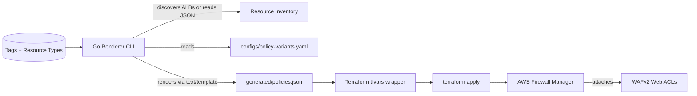

# aws-fms-secpolicy-learning

Dynamic, tag-driven AWS Firewall Manager (FMS) + WAFv2 lab that mixes Go discovery/rendering with Terraform-managed policies. The project shows how to turn resource metadata into opinionated security policies without hard-coding accounts or resource IDs.

---

## Why This Exists

Security teams often need to enforce the same WAF posture across many load-balanced apps, but the rules vary by tag (e.g., `env=prod` vs. `env=dev`). This repo demonstrates how to:

- Discover eligible targets (ALBs today) with the AWS SDK for Go v2.
- Map tag/resource-type combinations to policy variants declared in YAML.
- Render FMS `managed_service_data` JSON using Go templates.
- Feed the rendered payloads into Terraform `aws_fms_policy` resources.
- Re-run the workflow whenever metadata changes, producing predictable diffs.

The code base is intentionally small so you can extend it to other resources (CloudFront, API Gateway, regional WebACLs, etc.).

---

## End-to-End Flow



---

## Repository Layout

```
cmd/renderer          # CLI entrypoint (flags, IO plumbing)
configs/policy-variants.yaml
internal/
  config/             # YAML loader + validation
  discovery/          # ALB discovery using AWS SDK v2
  policy/             # Policy builder + template execution
  util/               # Structured logger helper
templates/fms_policy.tmpl
terraform/            # Demo infra + FMS policies
resources.json        # Sample discovery output (offline mode)
demo.sh               # Orchestrates discovery -> render -> terraform
```

Key supporting docs:

- `AGENTS.md` – expectations for AI contributors.
- `SCAFFOLD.md` – notes about extending the PoC.
- `BOTREADME.md` – legacy README retained for reference.

---

## Prerequisites

### AWS Org Setup

1. Enable AWS Organizations and designate a Firewall Manager delegated admin account.
2. From that admin account, confirm FMS is active and can manage AWS WAFv2 policies.
3. Ensure the account has permission to discover ALBs and create FMS resources (describe/load balancers, describe tags, wafv2, fms, iam pass role if needed).

### Local Tooling

- Go 1.21+
- Terraform 1.5+
- AWS CLI v2 (handy for identity checks)
- Configured AWS credentials (profile, SSO, env vars, etc.)

Quick sanity check:

```bash
aws sts get-caller-identity
go version
terraform version
```

---

## Running the Demo

### 1. End-to-End Script

```bash
./demo.sh
```

What it does:

1. Runs the renderer with `-discover` to pull ALBs from AWS (or uses `resources.json` if already present).
2. Writes `generated/policies.json`.
3. Wraps the JSON into `terraform/generated_policies.auto.tfvars.json`.
4. Executes `terraform init && terraform apply` inside `terraform/`.

### 2. Manual Steps

```bash
# Discover and render (or use -input to replay resources.json)
go run ./cmd/renderer \
  -discover \
  -region us-west-2 \
  -config configs/policy-variants.yaml \
  -output generated/policies.json

# Feed the output to Terraform
cat > terraform/generated_policies.auto.tfvars.json <<'JSON'
{
  "fms_policies_json": $(cat generated/policies.json)
}
JSON

(cd terraform && terraform init && terraform apply)
```

Destroy demo resources when finished:

```bash
(cd terraform && terraform destroy)
```

---

## Renderer CLI Details (`cmd/renderer`)

Flags:

- `-discover` – query AWS directly. When false, the tool reads `-input` JSON.
- `-input` – path to cached discovery output (default `resources.json`).
- `-config` – policy variant definition file (default `configs/policy-variants.yaml`).
- `-output` – destination for rendered policies (default `generated/policies.json`).
- `-region` – overrides AWS region for discovery; falls back to default SDK config if omitted.

The workflow:

1. Load variant config into strongly typed structs (`internal/config`).
2. Either discover ALBs (`internal/discovery.DiscoverALBs`) or load them from disk.
3. Feed resources into the policy builder (`internal/policy.BuildPolicies`).
4. Execute the `templates/fms_policy.tmpl` for each variant and marshal to JSON.

---

## Policy Variants Config

`configs/policy-variants.yaml` describes how tags map to behavior. Each entry includes:

```yaml
- name: prod-strict
  description: "Prod ALBs with locked-down rules"
  match:
    resource_type: "application-load-balancer"
    tags:
      env: "prod"
      sensitivity: "high"
  waf:
    managed_rule_groups:
      - name: AWSManagedRulesCommonRuleSet
    custom_rules:
      - name: block-insecure-paths
        statement: {...}
```

Important bits:

- `match.resource_type` lets you branch logic per ALB/CloudFront/etc.
- `match.tags` uses exact match on key/value pairs.
- `waf` payload is injected into the template as `ManagedServiceData`.

Add more variants to demo regional differences, rate-based rules, or geo blocks.

---

## Template (`templates/fms_policy.tmpl`)

This Go template emits the JSON structure that Terraform passes into `aws_fms_policy.managed_service_data`. It already handles:

- Required metadata (`resourceType`, `defaultAction`, etc.).
- Managed rule group wiring.
- Optional custom statements/rules via loops.

Update the template when you add new knobs to the YAML schema (e.g., `rateLimit`, `headerMatches`).

---

## Terraform Stack

Located in `terraform/` and split into:

- Demo VPC + ALB with environment/sensitivity tags.
- Wrapper module (modules/fms-setup) that stands in for org-level prep.
- `aws_fms_policy` resources fed by the renderer output.

Outputs include the ALB DNS name and rendered policy ARNs for quick inspection. Use `terraform output` after apply.

---

## Development Workflow

```bash
go fmt ./...
go test ./...
```

Tips:

- `generated/` is ignored by Git; safe for renderer output.
- Use `resources.json` to simulate discovery without AWS access.
- Add unit tests next to the packages you change (`internal/...`).

---

## Extending the PoC

Ideas straight from `AGENTS.md`:

1. Discover more resource types (CloudFront, API Gateway HTTP APIs, regional WAF ACLs).
2. Enrich policy depth: rate-based statements, header/path matches, geo blocks.
3. Introduce org scoping (OUs/account IDs) via include/exclude maps.
4. Improve developer experience with CLI dry-run/diff modes and resource summary tables.

---

## Troubleshooting

- **No resources discovered** – ensure ALBs exist in the chosen region and the caller has `DescribeLoadBalancers` + `DescribeTags`.
- **Template errors** – run the renderer with `-input resources.json` and inspect the console logs; they include variant names.
- **Terraform apply fails** – confirm Firewall Manager is delegated and that your AWS account has rights to create FMS policies.

Happy hacking!
